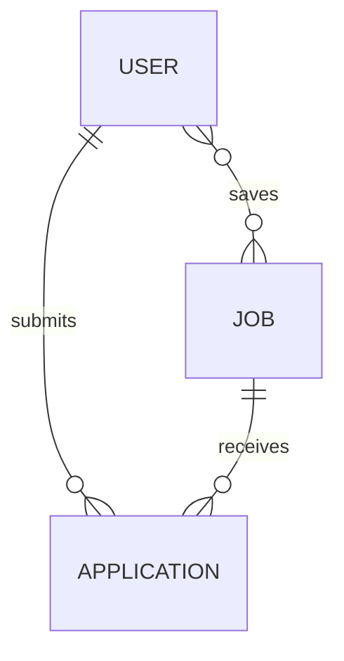

# MERN Stack Job Portal System

A fully-featured, responsive job portal built with the **MERN (MongoDB, Express, React, Node.js)** stack. This platform supports candidate/employer registration, job listing management, resume uploads, and an automated skill-matching recommendation engine that calculates compatibility scores between candidates and job requirements.

---

## 📂 Project Structure

The project is split into two primary directories: **`client`** (React frontend) and **`server`** (Express/Node.js backend).

```directory
job-portal/
├── client/                      # React Frontend
│   ├── public/                  # Public assets
│   ├── src/
│   │   ├── pages/               # Application pages
│   │   │   ├── Applications.jsx      # Admin view of job applications
│   │   │   ├── Dashboard.jsx         # Admin overall analytics & statistics
│   │   │   ├── Jobs.jsx              # Admin view to post/update/delete jobs
│   │   │   ├── Login.jsx             # Combined Login / Registration portal
│   │   │   ├── Profile.jsx           # User/Candidate profile preview
│   │   │   ├── UserApplications.jsx  # User's applied jobs history
│   │   │   ├── UserJobs.jsx          # Candidate job listing exploration & bookmarks
│   │   │   └── UserProfile.jsx       # Interactive user profile editor
│   │   ├── App.jsx              # Routing & Application Layout
│   │   ├── api.js               # Global API base URL configuration
│   │   ├── main.css             # Vanilla CSS design system & styles
│   │   └── main.jsx             # React application entry point
│   ├── package.json             # Frontend package configurations & scripts
│   └── index.html               # Main HTML entry point
│
├── server/                      # Node.js / Express Backend
│   ├── middleware/
│   │   └── auth.js              # JWT validation & role enforcement middleware
│   ├── models/                  # Mongoose MongoDB Data Schemas
│   │   ├── Application.js       # Candidate applications schema
│   │   ├── Job.js               # Job listing schema
│   │   └── User.js              # User profiles & auth schema
│   ├── routes/                  # Express REST API Routes
│   │   ├── applications.js      # Application submission & score recalculation
│   │   ├── auth.js              # Authentication endpoints (register, login)
│   │   ├── jobs.js              # Job posting & recommendation engine
│   │   └── user.js              # Profile operations, resumes, & saved jobs
│   ├── utils/
│   │   └── matching.js          # Core matching algorithm functions
│   ├── uploads/                 # Local directory for stored resume files
│   ├── index.js                 # Express server initialization & database connection
│   ├── seed.js                  # Database seeder for demo credentials
│   ├── nodemon.json             # Nodemon developer settings
│   └── package.json             # Backend dependencies & command scripts
```

---

## 🗄️ Database Architecture & Usage

This project uses **MongoDB** via **Mongoose ORM** to model and persist application state.

### Entity Relationship Diagram (Conceptual)


### Models & Schema Definitions

#### 1. User Model (`server/models/User.js`)
Stores details for both candidates and administrators. Features automatic schema timestamp tracking.
- `name`: String (Default: empty string)
- `email`: String (Unique index, used for authentication)
- `phone`: String
- `password`: String (Salted & hashed using Bcryptjs)
- `role`: String (Enum: `['admin', 'user']`, Default: `'user'`)
- `companyName` & `companyWebsite`: Strings (Populated for employers/admins)
- `savedJobs`: Array of ObjectIds (References `Job` model)
- **Profile fields**: Qualifications, colleges, graduation details, experience logs, projects, certifications, uploaded `resumeUrl` paths, lists of `skills`, `languagesKnown`, and preferences.

#### 2. Job Model (`server/models/Job.js`)
Represents individual employment or internship openings.
- `postType`: String (Enum: `['job', 'internship']`, Default: `'job'`)
- `title`: String
- `employmentType`: String (e.g., Full-Time, Part-Time)
- `skills`: Array of Strings (List of skills required for the job role)
- `workMode`: String (e.g., Remote, Hybrid, On-site)
- `location`: String
- `experienceNeeded`: String
- `salaryRange`: String
- `educationalBackground`: String
- `description` & `aboutCompany`: Strings
- `vacanciesAvailable`: Number (Default: 1)

#### 3. Application Model (`server/models/Application.js`)
Serves as the junction model tracking candidate applications to specific job listings.
- `userId`: ObjectId (References `User`)
- `jobId`: ObjectId (References `Job`)
- `userSkills`: Array of Strings (Snapshot of the candidate's skills at the time of application)
- `coverLetter`: String
- `matchScore`: Number (0 to 100 percentage based on skills compatibility)
- `fitSuggestion`: String (Enum: `['Good Fit', 'Average', 'Low Fit']`)
- `status`: String (Enum: `['pending', 'accepted', 'rejected', 'next_round']`, Default: `'pending'`)

---

## ⚙️ Core Logic: How the Database Works

### 1. Stateless Authentication Pipeline
- When a user registers or logs in, the backend hashes the password using `bcryptjs` and signs a JSON Web Token (JWT) with the user ID payload.
- On subsequent requests, the frontend supplies this JWT in the `Authorization` header (`Bearer <token>`).
- The authentication middleware (`server/middleware/auth.js`) intercepts the request, verifies the token signature, fetches the corresponding user from the MongoDB database (excluding password hash), and attaches the document model to `req.user`.

### 2. Skill-Matching & Recommendation System (`server/utils/matching.js`)
When a candidate applies for a job, the backend runs a custom matching algorithm:
* **Normalization**: The algorithm trims and downcases skills list items (e.g., `" React "` and `"react"` are treated as identical).
* **Scoring Rules**:
  * An **Exact Match** of a required skill awards **+20 points** (e.g., required `"node"` matches user skill `"node"`).
  * A **Partial Match** awards **+10 points** if a string includes or is included inside a skill (e.g., required `"react"` matches user skill `"react native"`).
* **Relative Scoring**: The final score is calculated relative to the maximum possible points (number of required skills multiplied by 20 points):
  $$\text{Score} = \text{Round}\left(\frac{\text{Total Scored Points}}{\text{Number of Job Skills} \times 20} \times 100\right)$$
* **Fit Categorization**:
  * **Good Fit**: Match score $\ge 70\%$
  * **Average**: Match score between $40\%$ and $69\%$
  * **Low Fit**: Match score $< 40\%$

#### Dynamic Updates
If a candidate updates their skills list on their Profile, the backend (`server/routes/user.js`) queries all existing applications belonging to that user, recalculates the `matchScore` and `fitSuggestion` for each application, and updates the database records. This ensures employer dashboard data remains synchronized in real-time.

### 3. File Attachment Persistence (Resumes)
- Multer middleware configures local storage destination inside the `server/uploads` directory.
- Uploaded files are assigned random unique prefixes to avoid namespace collisions.
- Upon successful upload, a web-accessible relative path (e.g., `/uploads/171542-resume.pdf`) is saved directly under the user's `resumeUrl` attribute in the MongoDB document.

---

## 🚀 Setup & Installation

### Backend Setup

1. Open your terminal and navigate to the backend folder:
   ```bash
   cd server
   ```
2. Install the server dependencies:
   ```bash
   npm install
   ```
3. Create a `.env` file from the provided example:
   ```bash
   copy .env.example .env
   ```
   *(Ensure `MONGO_URI` points to a running instance of MongoDB and adjust `JWT_SECRET` as needed).*
4. Seed the database with default administrator and user credentials:
   ```bash
   npm run seed
   ```
5. Start the Express server:
   ```bash
   npm run dev
   ```
   *The backend will run on port `5000` by default.*

### Frontend Setup

1. Open a new terminal window and navigate to the frontend folder:
   ```bash
   cd client
   ```
2. Install client-side dependencies:
   ```bash
   npm install
   ```
3. Start the Vite React development server:
   ```bash
   npm run dev
   ```
   *Open the URL provided in your console (usually `http://localhost:5173`) to interact with the platform.*

---

## 🔑 Default Credentials

Seeding the database creates the following credentials automatically:

* **Administrator/Employer Portal**:
  * **Email**: `admin@test.com`
  * **Password**: `123456`
* **Candidate Portal**:
  * **Email**: `user@test.com`
  * **Password**: `123456`
